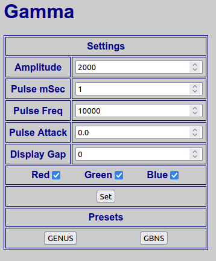

# Bringing Gamma Back, Again
https://www.wnycstudios.org/podcasts/radiolab/articles/bringing-gamma-back

From Wikipedia:

***A gamma wave or gamma Rhythm is a pattern of neural oscillation in humans with a frequency between 25 and 140 Hz, the 40-Hz point being of particular interest. Gamma rhythms are correlated with large scale brain network activity and cognitive phenomena such as working memory, attention, and perceptual grouping, and can be increased in amplitude via meditation or neurostimulation. Altered gamma activity has been observed in many mood and cognitive disorders such as Alzheimer's disease, epilepsy, and schizophrenia.***

#### Multi-sensory Gamma Stimulation Ameliorates Alzheimer’s-Associated Pathology and Improves Cognition
https://www.cell.com/cell/pdf/S0092-8674(19)30163-1.pdf
    
> Gamma Entrainment Using Sensory Stimuli (GENUS)
>  
> We presented 3- to 8- month-old male WT (C57BL6J) mice with 1 ms-long auditory tones coupled with 12.5 ms-long light pulses (auditory plus visual, or A+V, stimulation) at 40 Hz while recording neural activity in AC, CA1, or mPFC using 32-channel silicon probes as animals ran or rested on a spherical treadmill (STAR Methods). 
> 
> Tones for the stimulation conditions consisted of a 10 kHz tone that was 1 ms in duration and delivered at 60 dB
> 
> For audio-only stimulation, a 10 kHz tone was played at 40 Hz with a 4% duty cycle.
> For visual-audio stimulation, the audio stimulation was accompanied with surrounding light flickered at 40 Hz for 10 s periods with a 50% duty cycle. 

#### Gamma Band Neural Stimulation in Humans and the Promise of a New Modality to Prevent and Treat Alzheimer’s Disease
https://www.ncbi.nlm.nih.gov/pmc/articles/PMC6130417/

A different tone description:

> Gamma activity is electrical activity which occurs at frequencies ranging from 30–100 Hz [18]; with the 40 Hz gamma activity of most interest. 
> 
> GAMMA BAND NEURAL STIMULATION (GBNS)
> 
> Neurophysiological basis of brain stimulation by external sources
> 
> The auditory stimulus was comprised of monaural clicks or tone bursts delivered via an ear phone. The clicks were delivered at 10 Hz while the tone bursts consisted of a 500 Hz tone supplied at different frequencies including 40 Hz lasting 6 ms with a 2 ms rise and fall.
> 
> auditory stimuli vary from clicks to bursts and from beats to pulses

##### Optogenetically Modified Interneurons
> It was further shown that increasing gamma activity in the CA1 region of the hippocampus, by stimulation of optogenetically modified interneurons using blue light at 40 Hz, reduced Aβ levels by approximately 50% and was mediated by both neural and microglia mechanisms.

https://www.scientifica.uk.com/learning-zone/optogenetics-shedding-light-on-the-brains-secrets
> In 2005, Karl Deisseroth and colleagues, published their seminal paper "Millisecond-timescale, genetically targeted optical control of neural activity" (not as catchy as optogenetics, right?). Published in the journal Nature, this was the first research paper to fully describe optogenetics as a strategy that made neurons sensitive to light and then used light to stimulate them. The paper showed how, by combining optical technologies and breakthroughs in genetics, it is possible for researchers to excite or inhibit specific neurons within the brain and study the outputs.
> 
> In order to get the ion channels expressed within the brain, a genetically modified virus was made. This virus, when injected into an area of the brain, is able to recombine its DNA with the DNA of the host cells. Once recombined, all of the cell dynamics and machinery necessary to express the ion channel gene is available, and the cell will begin expressing the channels on its cell membrane.

This project will generate GENUS or GBNS audio pulses with accompaning visual pulses at 40Hz.

# Setup

- ESP32 (https://www.adafruit.com/product/3405)
- I2S Amplifier (https://www.adafruit.com/product/3006)
- DotStar LEDS(https://www.adafruit.com/product/2239)

The program can be compiled with either PlatformIO or Arduino IDE.

The first time it boots it will create a Soft Access Point with **SSID**: `Gamma` and **PSK**: `carbondioxide`.  Open <http://gamma.local/config> to configure the WiFi 

<http://gamma.local/> allows for selection of the Gamma parameters:

